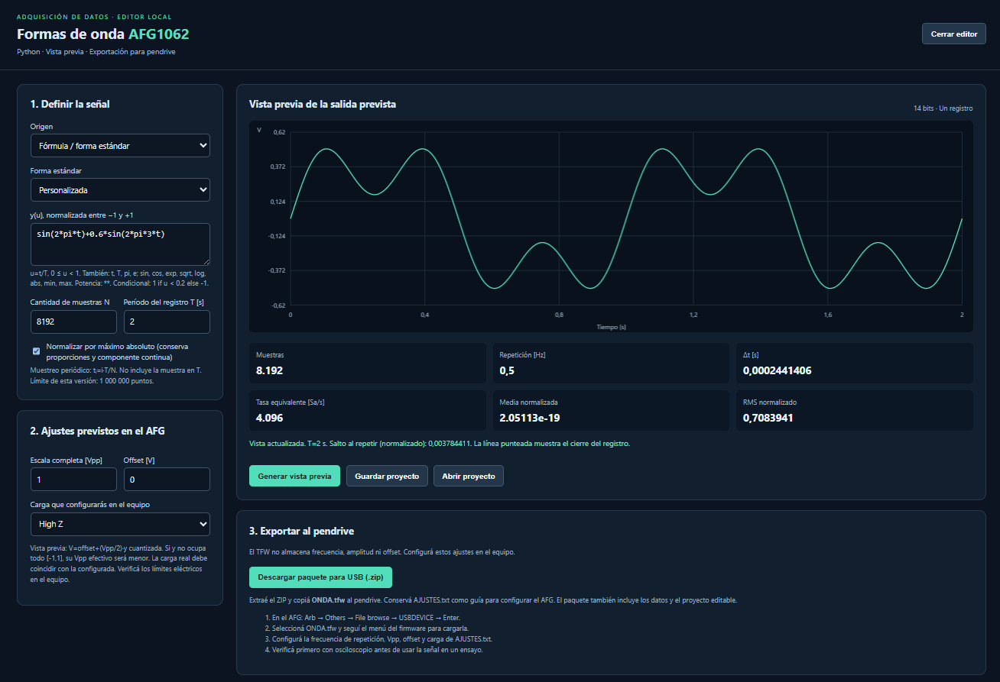

# AWFgenerator

Editor local de formas de onda en Python, con vista previa en el navegador y exportación de archivos TFW para cargar mediante pendrive en un Tektronix AFG1062.



## Inicio rápido

Requiere **Python 3.10 o posterior**. Utiliza únicamente la biblioteca estándar: no requiere instalar paquetes, Tkinter, VISA ni permisos de administrador.

```sh
git clone https://github.com/marzzelo/AWFgenerator.git
cd AWFgenerator
python editor.py
```

En Windows también se puede abrir `Iniciar.cmd`. La aplicación abre el navegador en una dirección local `http://127.0.0.1:.../`. Para detener el servidor, usar **Cerrar editor** o Ctrl+C en la consola. No requiere Internet durante el uso.

## Funciones

- Generación por fórmulas y formas estándar: seno, cuadrada, triangular, rampa, multiseno, chirp y seno amortiguado.
- Edición mediante nodos con interpolación lineal.
- Importación CSV de amplitud o tiempo y amplitud, con validación del muestreo uniforme.
- Vista previa de la tensión prevista tras cuantización de 14 bits.
- Normalización opcional, guardado y apertura de proyectos JSON.
- Exportación de un ZIP con `ONDA.tfw`, datos CSV, proyecto y ajustes para configurar manualmente el instrumento.
- Hasta 1 000 000 de muestras por registro.

## Uso con pendrive

Generar la vista previa, descargar y extraer el paquete ZIP y copiar **ONDA.tfw** al pendrive. Consultar **AJUSTES.txt** para configurar la frecuencia de repetición, amplitud, offset y carga en el generador.

**Validación física TFW en el AFG1062 exitosa, confirmada por Marcelo Valdéz.** El editor no se comunica con el instrumento ni activa sus salidas.

El archivo TFW no contiene frecuencia, amplitud ni offset. Estos ajustes se aplican manualmente en el equipo. Verificar la primera señal con osciloscopio antes de utilizarla en un ensayo.

## Documentación y ejemplo

- [Manual completo y fuentes técnicas](LEEME.md)
- [Alcance de la verificación realizada](VERIFICACION.md)
- [Ejemplo simulado: seno de 1 Hz para prueba USB](Ejemplo_SENO_1Hz_USB.zip)

## Pruebas

```sh
python -m unittest -v test_waveform.py
```

Las pruebas cubren muestreo periódico, normalización, CSV, nodos, validación de fórmulas, estructura binaria y contenido de los paquetes exportados.

## Archivos principales

| Archivo | Función |
| --- | --- |
| `editor.py` | Servidor local y API |
| `interface.html` | Interfaz, gráfico y controles |
| `waveform.py` | Cálculo de muestras y codificación TFW |
| `Iniciar.cmd` | Inicio en Windows |
| `test_waveform.py` | Pruebas automatizadas |

Los datos de usuario (`data/`), registros, archivos temporales (`work/`) y cachés no se versionan.
